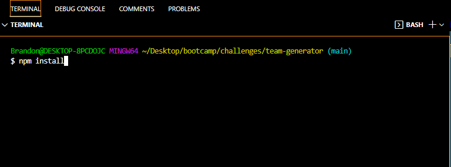
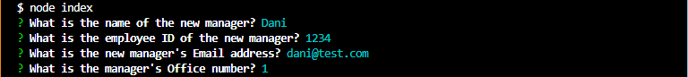
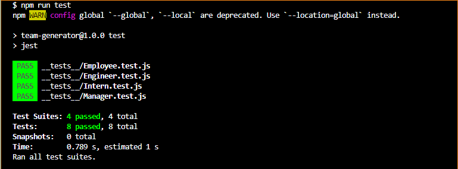
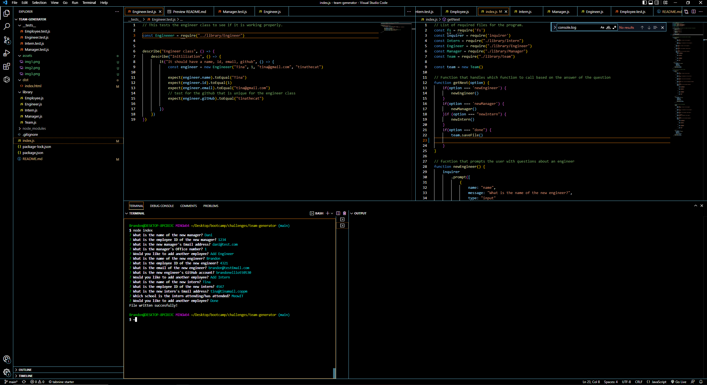

# TEAM Generator
---
This project is an example of a program that uses the node.js package named Inquirer to ask questions to the user, and based on those questions, it will generate an HTML page. Technologies used in this program include: HTML, JavaScript, node.js, bootstrap, inquirer, jest, and others. 

## Requirements
---
```md
GIVEN a command-line application that accepts user input
WHEN I am prompted for my team members and their information
THEN an HTML file is generated that displays a nicely formatted team roster based on user input
WHEN I click on an email address in the HTML
THEN my default email program opens and populates the TO field of the email with the address
WHEN I click on the GitHub username
THEN that GitHub profile opens in a new tab
WHEN I start the application
THEN I am prompted to enter the team manager’s name, employee ID, email address, and office number
WHEN I enter the team manager’s name, employee ID, email address, and office number
THEN I am presented with a menu with the option to add an engineer or an intern or to finish building my team
WHEN I select the engineer option
THEN I am prompted to enter the engineer’s name, ID, email, and GitHub username, and I am taken back to the menu
WHEN I select the intern option
THEN I am prompted to enter the intern’s name, ID, email, and school, and I am taken back to the menu
WHEN I decide to finish building my team
THEN I exit the application, and the HTML is generated
```

## Usage
---

To use the application, the user must first upen the project in their code editor. After navigating to the correct folder, the user must perform an "npm install" command to install the dependencies of the program. These dependencies include inquirer, and jest. (see IMG1) After performing the install, the user must simply perform a "node index.js" command. After they enter that command, the user will be prompted with a series of questions. (see IMG2) Once the first teammate is added, the user will be given the options to add either a new manager, intern, engineer, or have the option of "done" which will end the program, and write the HTML in the dist folder. (see IMG3)

#### IMG1
---


#### IMG2
---


#### IMG3
---


## Tests
---
Included in this program, there are several test suites that can be performed. These tests use jest, a node.js package that is installed when the user installs dependencies. to evoke the tests, the user must simply perform a "npm run test" command in the command line. The tests will then run, and check if all of the constructors are working properly. (see img4)

#### IMG4
-----


## Challenges in development
---
The only real struggles that I had with this project were the tests. Getting the getName(), getId(), getEmail(), and getRole() methods to work in the tests was difficult. The syntax is what made it the most difficult for me. Otherwise, this project went relatively smoothly. Thanks to my tutor, and instructional staff.

## Screenshot
---


## Demonstration Video
---
[Link to demonstration video](https://drive.google.com/file/d/1n3VuqLGjTFx85-dI6VMEbt9dkmsLHlLu/view) 
Please insure that third party cookies are enabled so the video can be played when the link is clicked. 

## GitHub link
---
[GitHub Repo](https://github.com/brandonelliott0530/team-generator)

## Contact Me
---
Email: brandonelliott0594@gmail.com
GitHub: https://github.com/brandonelliott0530